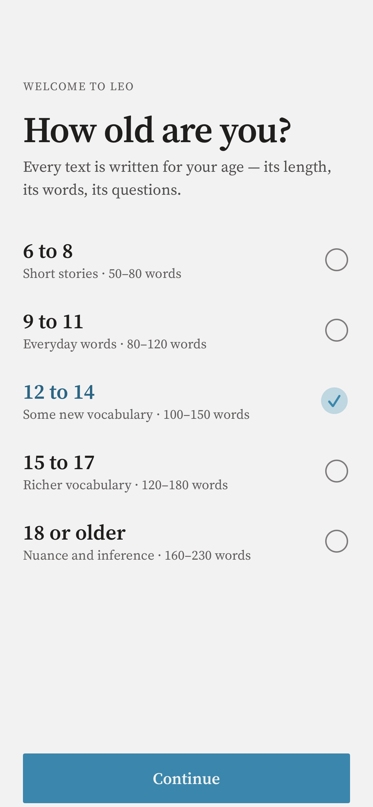
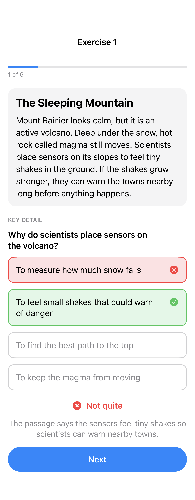
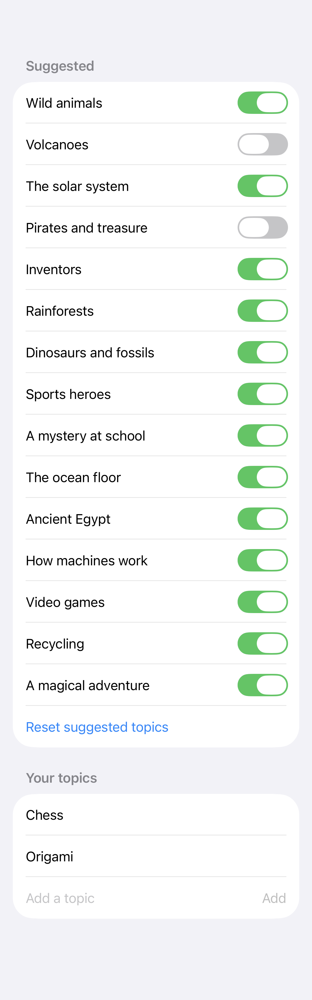

# Leo

Leo helps people of all ages build their reading comprehension. Each round has various short texts, written for the reader's age on topics they like, each followed by a question. Everything is generated on the device by Apple's [Foundation Models](https://developer.apple.com/documentation/foundationmodels) framework, so Leo works offline and nothing the reader does leaves their iPhone or iPad.

<table>
  <tr>
    <td><picture><source media="(prefers-color-scheme: dark)" srcset="LeoTestsSnapshots/OnboardingSnapshotTests/pickerWithSelection.12-14-dark-en.png"></picture></td>
    <td><picture><source media="(prefers-color-scheme: dark)" srcset="LeoTestsSnapshots/ExerciseViewSnapshotTests/wrongAnswer.wrong-dark-en.png"></picture></td>
    <td><picture><source media="(prefers-color-scheme: dark)" srcset="LeoTestsSnapshots/ResultViewSnapshotTests/correct-_.5-of-6-dark-en.png"></picture></td>
    <td><picture><source media="(prefers-color-scheme: dark)" srcset="LeoTestsSnapshots/TopicsEditorSnapshotTests/customized.9-11-customized-dark-en.png"></picture></td>
  </tr>
</table>

## Why Leo

The idea for Leo came from the PISA 2025 results, published by the OECD on September 8, 2026. They showed a historic drop in student performance around the world, and reading had the sharpest decline of all: across OECD countries, reading scores fell 28 points between 2015 and 2025. ([Education International](https://www.ei-ie.org/en/item/32952:new-pisa-report-reveals-decline-in-student-performance-amid-chronic-teacher-shortage-and-shrinking-attention-spans), [BBC News Mundo](https://www.bbc.com/mundo/articles/c8r6yl61v0ko), in Spanish)

Reading and understanding a text is the foundation for learning everything else. Leo is meant to make practicing that skill easy and engaging, at any age: short texts at the right level, on topics the reader cares about, with feedback that explains the answer.

## Features

- **Five age groups:** 6–8, 9–11, 12–14, 15–17 and 18+. The age group sets how long the passages are and how complex their language is, from 50–80 words of short, everyday sentences up to 160–230 words with varied structure and precise vocabulary.
- **Five comprehension skills:** every round mixes questions on the main idea, key details, inference, vocabulary in context and the author's purpose.
- **Topics the reader chooses:** each age group has its own list of suggested topics that can be turned on and off, and readers can add their own. The on-device model checks that a new topic suits the reader's age and tidies up its wording before it's saved.
- **Feedback that teaches:** after a wrong answer, Leo shows the correct one and a short explanation that points back to the passage.
- **Reads in your language:** texts are written in the device's language when the on-device model supports it, and in English otherwise. The interface is available in English, Spanish and Brazilian Portuguese for the moment.
- **Little waiting for questions:** the exercises start generating in the background as soon as the app opens, before the reader taps Start.
- **Accessible:** supports Dynamic Type up to accessibility sizes, Dark Mode and VoiceOver.

## How it uses Foundation Models

Leo uses Apple's on-device language model for two jobs: writing exercises and reviewing custom topics.

### Writing exercises

[`ExerciseGenerator`](Leo/Services/ExerciseGenerator.swift) asks the model for a `@Generable` [`GeneratedExercise`](Leo/Models/Exercise.swift): a title, a passage, a question, the correct answer, two or three incorrect answers and an explanation. Guided generation means the output always has this structure, with no JSON parsing.

- **The app places the correct answer.** The model writes the correct answer and the distractors as separate fields, and the app shuffles them, so the app, not the model, decides where the correct answer appears.
- **The app checks every exercise.** Exercises with a missing answer, duplicate options or a passage of the wrong length are discarded, and Leo tries the next topic instead (up to three).
- **Runaway passages are stopped early.** The response is streamed, and a passage that keeps going past the accepted length is abandoned after a few seconds instead of running until the token limit.
- **A fresh session per exercise** keeps every request well inside the model's context window.
- **Prompts are in English, content is in the reader's language.** The instructions tell the model which language to write in, using [`ContentLanguage`](Leo/Services/ContentLanguage.swift), which picks the device's preferred language if the model supports it.

### Reviewing custom topics

When a reader adds a topic, [`TopicValidator`](Leo/Services/TopicValidator.swift) asks the model for a `@Generable` `TopicReview`: whether the topic is suitable for the reader's age, the topic tidied up (spelling, capitalization), and if it's rejected, a short, friendly reason in the reader's language. Guardrail violations and refusals become a generic rejection message instead of an error.

### When the model isn't available

If Apple Intelligence is turned off, the device isn't eligible or the model is still downloading, Leo explains what's needed instead of showing exercises.

## Privacy

Leo has no accounts, no analytics and no network code. Exercises and topic reviews are generated on the device. The only thing Leo stores is the reader's preferences (age group and topics), in `UserDefaults` on the device.

## Requirements

- An iPhone or iPad that supports Apple Intelligence, with Apple Intelligence turned on
- iOS / iPadOS 26.5 or later
- Xcode 27.0 to build (the version is pinned in [`.xcode-version`](.xcode-version))

## Project structure

```
Leo/
├── Models/        AgeGroup, Exercise and ComprehensionSkill, ReaderPreferences, Topic
├── Services/      ExerciseGenerator, TopicValidator, ContentLanguage, QuizModel, PreferencesStore
└── Views/         Onboarding, Welcome, Loading, Exercise, Result, Settings and Topics editor
LeoTests/          Unit, snapshot and live-model tests
LeoTestsSnapshots/ Reference images and text snapshots
docs/              Feature specifications and the test plan
```

## Testing

There are two test plans:

| Test plan | What it covers | Model |
|---|---|---|
| `Leo` | Unit tests for models, prompts, the round plan and preferences, plus view snapshots in light and dark mode and at accessibility sizes | Stubbed, so runs are fast and repeatable |
| `LeoLiveModel` | Exercise generation and topic review end to end | The real on-device model; tests skip themselves when it isn't available |

View snapshots are recorded on the **iPhone 18 Pro simulator with iOS 27.0** and fail with a clear message on any other device or OS. To run the main test plan:

```bash
xcodebuild test -project Leo.xcodeproj -scheme Leo -testPlan Leo -destination 'platform=iOS Simulator,name=iPhone 18 Pro,OS=27.0'
```

The full setup is described in [docs/Leo-Test-Coverage-Plan.md](docs/Leo-Test-Coverage-Plan.md).

### Continuous integration

Every pull request to `main` runs SwiftLint, SwiftFormat and the `Leo` test plan, which must pass before merging, and gets an advisory code review from Claude. The `LeoLiveModel` plan runs only on demand, from the Actions tab.

## Status and roadmap

Leo is in development and isn't on the App Store or TestFlight yet. Planned next:

- **Progress tracking:** a history of rounds and scores, with results per comprehension skill
- **Adaptive difficulty:** adjusting passage level and skills to how the reader is doing
- **More languages** for the interface
- **Read aloud and vocabulary help:** listening to a passage, and tapping a word to see what it means

## License

Copyright © 2026 Victor Arana. All rights reserved.

The source code is public so you can read it and learn from it, but it isn't licensed for reuse, modification or redistribution.
